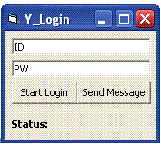



## Y\_Login

### Description

Yahoo YMSG Protocol Example. Shows how to login to the service,and send/recieve messages. Needs a dll which you can get here:

http://www.arubs.net/YMSG12ENCRYPT.dll
 
### More Info
 

             |
---                |---
**Submitted On**   |2005-10-16 07:45:58
**By**             |[Arub](https://github.com/Planet-Source-Code/PSCIndex/blob/master/ByAuthor/arub.md)
**Level**          |Intermediate
**User Rating**    |4.8 (19 globes from 4 users)
**Compatibility**  |VB 6\.0
**Category**       |[Internet/ HTML](https://github.com/Planet-Source-Code/PSCIndex/blob/master/ByCategory/internet-html__1-34.md)
**World**          |[Visual Basic](https://github.com/Planet-Source-Code/PSCIndex/blob/master/ByWorld/visual-basic.md)
**Archive File**   |[Y\_Login19421010212005\.zip](https://github.com/Planet-Source-Code/arub-y-login__1-62968/archive/master.zip)

